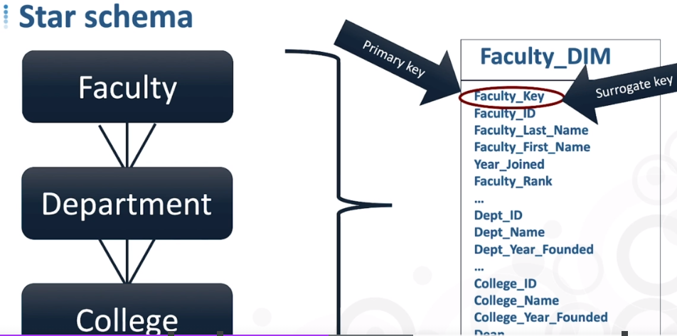
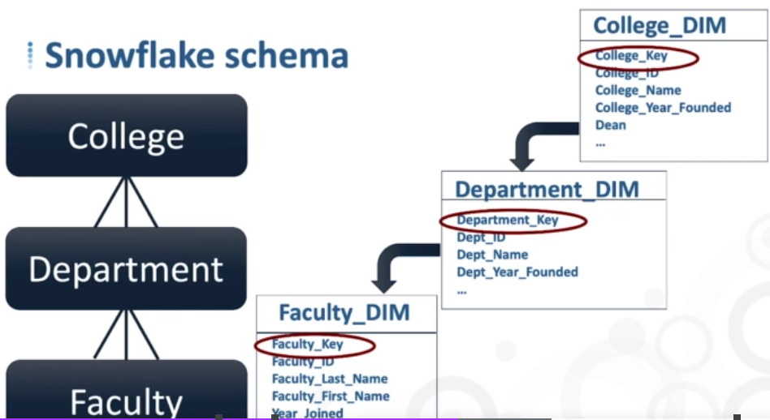

# Data Warehouse fundamentals summary notes 

  

## Data Warehousing general concepts 

* DB and WH are not the same thing. a DW is written on top of a DB, so *usage* Vs *platform*.
  
* DW are useful for two reasons:
    * Data once transformed are available to support data-driven decisions.
    * One-stop shopping: data are integrating in one location
      
* There are a few rules to follow when we build a DW.

  

## Data Warehouse architecture 

**1. Centralized DW Vs Component-based DW**

There are two different approaches to a DW architecture

| Centralized DW | Component-based DW |
| -------- | ------- |
| Default option | Overcome org challenges but more complext to cross integrate different components |
| One-stop shopping: Single DW where all your data sources feed in  | It may create inconsistencies across data  |
| Lower data governace efforts | 
| More appropriate for Big Data | 

  

**2. ETL Vs ELT**

* The difference between the two workflows is the order of the transformation
    * ETL (traditional): data are loaded in their finished and transformed state
    * ELT: Transformation capacity is increased, exploiting the cloud platform. You are not committed to the hardware footprint

  
 
**3. Staging**

  * First stop of a DW and landing zone of data sources. The staging layer feeds into user access layer in a form that is accessible for further work

  * Staging has one-to-one relationship with data sources (which may come from different vendors)
    
  * Staging can be persistent Vs non-persistent
      *  non-persistent means that data stage layers are erased when are added to the user access layer. It requires less storage space but potential data quality issues

  *  Source data may need to be refreshed: new data, modified data, delete data. There are different approaches ( The first two are the most common):
      * Append pattern: Append on top
      * In-place update: Changing only existing rows 
      * Complete replacement
      * Rolling append: Set out a time window and those observations that are outside that are dropped
   

  

**4. Data Transformation**

* Data transformation is a key part of the process: it is the intermediate step which make sure that data are uniform across the different sources and amend possible inconsistencies

* Most common transformations are:
    * Data value unification (e.g. country full name and code)
    * Data type and unifications
    * De-duplications
    * Vertical and horizontal slicing when only certain information is relevant for analytical purposes
    * Correct potential known errors

  
 
**5. Data warehousing design**

* Data dimensionality refers to organize data by measurements and then filter and group data by context
* In a DW setting, when we talk about measurements, we refer to **facts** and dimensional context as **dimensions**
  
| Facts | Dimensions |
| -------- | ------- |
| Numeric and quantifiable | Context and attributes of facts |
| Measurements and metrics  | Included in dimensional tables  |
| Included in fact tables |
| Facts can be additive, non-additive, semi-additive |

* Exaples of non-additive facts include: margins, ratios, percentages, and averages

* There are two different approaches to implement facts and dimension data: Star schema Vs Snowflake schema. Star and Snowflake schemas share
  the same dimensions but they are materialized with different dimension table representations  

| Star Schema | Snowfalke Schema |
| -------- | ------- |
| All dimensions along a given hierarchy is one dimension table | Each dimension/dimentional level in its own table |
| Only one level away from the fact table along each hierarchy | One or more levels away from fact tables among each hierarchy |
| Dimension tables organized as a star around fact tables | Dimension tables organized as a snowflake around fact tables |
| Overall fewer database joins | Overall more joins required |
| Primary & foreign key relationships straightforward | Primary & foreign key relationships more complex |
| More storage space required: more repetitive data (denormalized approach) | Less storage space required: less repetitive data (normalized approach) |

* Database keys
  * They represent the logical relationships to relate data across different tables.
  * There are two fundamentals key types: (i) *Primary* Vs *Foreign* keys; (ii) *Natural* Vs *Surrogate* keys
    * Primary Key: unique identifier for each row in a BD table, which establishes the grain of the table.
      It could be a single column (field) or it may require more than one field. 
    * Foreign Key: some 'other' table primary key. Used to indicate logical relationship helping data integration and query performances
    * Natural & surrogate keys: Natural keys belong to the source systems, and they travel to the DW with the rest of the data, if they exist. However, in DW, it is best practice to use surrogate keysas primary/foreign keys to relate data across tables.
      Surrogate keys do not have business meaning and they are generated in the DW enviroment.   

  

**6. Design facts and dimensions in fact tables and dimension tables**

1. Dimension tables
    * Key DW subject areas that provides context to measurements
    * One-stop shopping for that dimensional subject
    * Dimension tables can be *flat* or *Hierarchical* 
    * For *Hierarchical* dimensions, the distinction between star and snowflake schema becomes relevant:
      * In a star schema:
        *  All dimensions along a given hierarchy is one dimension table
        *  The table includes a primary-surrogate key for the terminal dimension
        *  The table may includes the natural keys of next higher level dimensions  
      * In a snowflake schema:
        * 1 table for each level of hierachy
        * Every non-terminal dimension has a primary-surrogate key and a next-higher level primary-surrogate key as a foreign key
        * Every terminal dimension has a primary-surrogate key but not foreign key, since there aren't further dimensions at a higher schema

 &nbsp; &nbsp;  

2. Fact tables
    * There are 4 different types of fact tables, each of which is used for different purposes
      | Fact table type | Usage |
      | -------- | ------- |
      | Transaction-grained | Record from a transaction |
      | Periodic snapshot | Track a given measurement at a regular interval  |
      | Accumulating snapshots | Track the progress of a business process through formally defined stages |
      | Factless fact | * Record the occurrence of a transaction that has no measurements   * Record coverage or eligibility relationships

    * Transaction-grained fact tables
      * Tables where we store facts from our transactions, formally defined as **grained** because they are at the grain that defines the fact table itself  
      * It is possible to store two ore more facts in the same table only if the following rules apply:
        1. Facts are avaialble at the same level of granularity (i.e. same level of detail)
        2. Facts occurr simultaneosly
      * Primary keys for fact tables work differently from dimension tables:
        * A PK is defined as unique identifier for each row in a DB table, as in a dimension table
        * However, it is created as the combination of all foreign keys relating back to dimension tables (which by definition are the primary-surrogate keys of the dimension table of reference, even if the fact table has a natual key.
        * In a fact table, fields that are designated as primary key (potential combination among different fileds) are also designated as foreign key

  
           &nbsp; &nbsp; 
In this example *student_key* and *date_key* make up together the primary key of the *tuition_bill_fact* table and each of them by itself are designated as foreign key: *student_key* is the PK of the *student_dim* table, while *date_key* is PK of the *date_dim* table

    * Periodic snapshot fact tables
      * They take and record regular periodic measurements and there are 2 main types:
        1. Fact tables that aggregate results of regular transactions (e.g. EoW account balances, starting from a daily transaction fact tables).
           These tables are created to have access to an easier version of the grained transaction fact table to answer certain types of business questions more directly 
        2. Fact tables whose levels are not related to regular transactions. These levels just exsist and can be measured

    * Accumulating snapshots
      * They track the progress of a business process, keeping track of (i) the elapsed time spent in each phase (incl. both completed and in-progress phases), and (ii)
        other measurements as process proceeds
      * They also introduce the concept of multiple relationships from a fact table to a single dimension table
      * Example: number of days elapsed in between each phase of a finacial aid application process [[ Add picture ]]
     
     * Factless tables - there are two different types:
       1. Record occurence of transactions that have no measurements:
           * The "measurement" is actually the occurence of the event, i.e. presence of a row in the (factless) table
           * Only include PK/FK columns or in some times a *tracking fact* filed - a flag with value 1
           * So they are created to *count()* the row or *sum()* the tracking values
       2. Record a particular relationship or association among multiple parties, even if no transactions actually occur
           * Typically (but not always) between a starting and ending date or time [[ Add example ]]
        
     * [[ADD comparison between STAR VS SNOWFLAKE schemas fact tables ]]   

  

**7. Managing DW history through changing dimensions (SCDs)**

* SCDs are multiple techniques used to manage hisotry within data warehouses, based on various historical data policies
* SCDs enable DWs to appropriately manage history regardless of policies in transactional applications
* Three are the most common SCD Types

| SCD | Description | Description |
| -------- | ------- | ------- |
| 1 | SCD overwriting old data, no history retention | * It replaces old values with new ones   * Same rows and columns in the DB table   * Common use case: correcting errros  
| 2 | SCD maintainig unlimited history | * Existing rows remain as they are   * New row added to the dimensional table   * New row reflects the current state of all the attributes   * Complications with reporting analytics  
| 3 | SCD maintainig unlimited history | Add a new column, ending up with a "old value column" and a "new value column"
